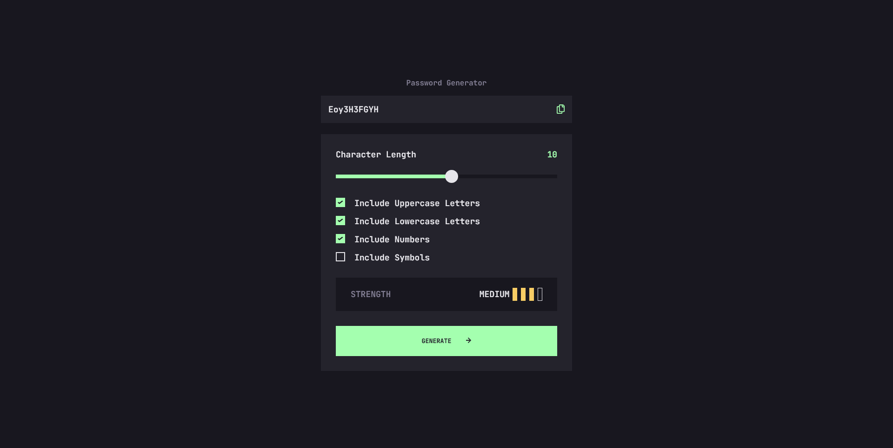

# Frontend Mentor - Password generator app solution

This is a solution to the [Password generator app challenge on Frontend Mentor](https://www.frontendmentor.io/challenges/password-generator-app-Mr8CLycqjh). Frontend Mentor challenges help you improve your coding skills by building realistic projects. 

## Table of contents

- [Overview](#overview)
  - [The challenge](#the-challenge)
  - [Screenshot](#screenshot)
  - [Links](#links)
- [My process](#my-process)
  - [Built with](#built-with)
  - [What I learned](#what-i-learned)
  - [Continued development](#continued-development)
  - [Useful resources](#useful-resources)
- [Author](#author)


## Overview

### The challenge

Users should be able to:

- Generate a password based on the selected inclusion options
- Copy the generated password to the computer's clipboard
- See a strength rating for their generated password
- View the optimal layout for the interface depending on their device's screen size
- See hover and focus states for all interactive elements on the page

### Screenshot




### Links

- Solution URL: [Repository URL](https://github.com/ikitamalarose/password-generator-app-challenge.git)
- Live Site URL: [Visit the website](https://password-generator-app-challenge.vercel.app/)

## My process

### Built with

- HTML5 
- CSS custom properties
- Flexbox
- CSS Grid
- JavaScript

### What I learned

In this project, I gained a deeper understanding of handling touch events for mobile devices and their equivalent mouse events for desktop environments. I also implemented a feature to copy the generated password to the clipboard using the navigator.clipboard API. Here are some key points:

- **Touch Events and Mouse Events** :
To ensure the app works smoothly across both mobile and desktop devices, I learned to handle touch events (`touchstart`, `touchmove`, `touchend`) and their mouse event counterparts (`mousedown`, `mousemove`, `mouseup`). This allowed me to provide a consistent user experience regardless of the input method.

  - `touchstart`: This event is triggered when the user touches the screen. It's equivalent to the mousedown event on desktops.

  - `touchmove`: This event is triggered when the user moves their finger across the screen. It's equivalent to the mousemove event on desktops.

  - `touchend`: This event is triggered when the user lifts their finger off the screen. It's equivalent to the mouseup event on desktops.

  ```js
  // Handling touch events
  element.addEventListener('touchstart', handleTouchStart);
  element.addEventListener('touchmove', handleTouchMove);
  element.addEventListener('touchend', handleTouchEnd);

  // Handling mouse events
  element.addEventListener('mousedown', handleMouseDown);
  element.addEventListener('mousemove', handleMouseMove);
  element.addEventListener('mouseup', handleMouseUp);

  function handleTouchStart(event) {
    // Handle touch start
  }

  function handleTouchMove(event) {
    // Handle touch move
  }

  function handleTouchEnd(event) {
    // Handle touch end
  }

  function handleMouseDown(event) {
    // Handle mouse down
  }

  function handleMouseMove(event) {
    // Handle mouse move
  }

  function handleMouseUp(event) {
    // Handle mouse up
  }
  ```
- **Copy to Clipboard** :

  I also implemented a feature to copy the generated password to the clipboard using the navigator.clipboard API. This API provides a simple and secure way to interact with the clipboard.

  Here's how I used the navigator.clipboard API:

  ```js
  function copyToClipboard(textToCopy) {
    navigator.clipboard.writeText(textToCopy)
        .then(() => {
            console.log(`${textToCopy} was copied`);
        })
        .catch(err => {
            console.error("Copy failed", err);
        });

  ```

## Author

- Frontend Mentor - [@ikitamalarose](https://www.frontendmentor.io/profile/ikitamalarose)
- GitHub - [@ikitamalarose](https://github.com/ikitamalarose)
- Twitter - [@ikitamalarose](https://www.twitter.com/ikitamalarose)
- Email - [laroseikitama@gmail.com](mailto:laroseikitama@gmail.com)